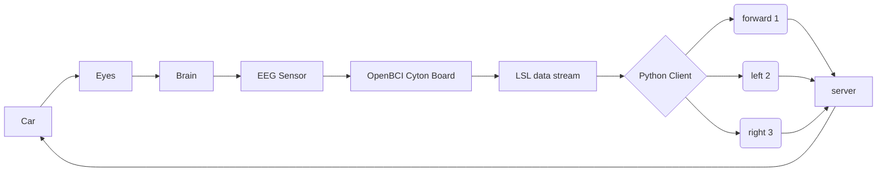

# Neural Signal Operated Intelligent Robot


## Introduction

**BCI** using **SSVEP** is **swift**, **precise**, and **portable**, ideal for tasks like spelling where users gaze at flashing characters to convey commands. Research efforts concentrate on enhancing classification capacity and accuracy. Given the complexity of improving **SSVEP** algorithms, we, as high school students, opted to adapt existing algorithms and explore SSVEP applications, specifically in **robot maze navigation**—a domain posing **real-time** decision-making challenges, as discussed in recent studies.
Typically, robot navigation revolves around sensor enhancement and algorithm optimization. While autonomous robots excel in unsupervised settings, combining human guidance with robotic systems can be beneficial when timely decisions are crucial. Our innovative system proposes SSVEP-guided robot navigation, enabling contactless human direction. The robot halts at intersections for guidance, with the operator indicating **"forward," "left," or "right" via gaze-directed LEDs**, leveraging human overview to swiftly exit mazes.
We envision this human-robot collaboration model enhancing the quality of life in eldercare facilities, facilitating routine tasks and promoting independence.

When the car determines that it needs to receive instructions, it will **start flashing lights**. Then, the **CYTON board** will read data from the brain by **OpenBCI Cyton board** and send it to the **Python client**. The Python client analyzes the SSVEP data and converts it into instructions for forward (1), left turn (2), or right turn (3), which will be sent to the **Python server**. This process will take about three seconds, and the car will automatically **obtain data** from the server and use it to control the motor movement, thus looping around.



## Requirements

| name                                 | function                         |                             website                             |
| :----------------------------------- | :------------------------------- | :-------------------------------------------------------------: |
| Cyton board                          | data conversion                  | [openBCI](https://docs.openbci.com/GettingStarted/Boards/CytonGS/) |
| Python                               | data processing and flask server |            [Python](https://www.python.org/downloads/)            |
| Ear clip electrodes and wires        | data collection                  | [openBCI](https://docs.openbci.com/GettingStarted/Boards/CytonGS/) |
| Arduino based ESP32 board            | car CPU                          |                 [Arduino](https://www.arduino.cc/)                 |
| Motor and wooden based vehicle frame | car frame                        |                             [Nolink]()                             |
| LED, resistance and lithium battery  | car material                     |                             [Nolink]()                             |

#### Python lib

Python (LSL connection): `pip install pylsl`

Python (Server connection): `pip install requests`

Python (AI frame): `pip install scikit-learn`

Python (AI frame): `pip install tensorflow-gpu==2.0.0`

Python (Scipy): `pip install scipy`

Python (Server frame): `pip install flask`

#### Arduino lib

ArduinoJson lib `ArduinoJson`

## Algorithm implementation

#### Arduino Algorithm

By create FreeRTOS tasks to let the LED and the network work together

```cpp
TaskHandle_t TASK_Handle1 = NULL; //Task handle for light
TaskHandle_t TASK_Handle2 = NULL;
TaskHandle_t TASK_Handle3 = NULL;
TaskHandle_t TASK_net = NULL;     //Task handle for network

/*
...
*/

xTaskCreate(
                    net,
                    "net",
                    24*1024,
                    NULL,
                    4,
                    &TASK_net);
  xTaskCreate(
                    TASK1,
                    "Task1",
                    24*1024,
                    NULL,
                    1,
                    &TASK_Handle1);
 
  xTaskCreate(
                    TASK2,
                    "Task2",
                    24*1024,
                    NULL,
                    2,
                    &TASK_Handle2);
  xTaskCreate(
                    TASK3,
                    "Task3",
                    24*1024,
                    NULL,
                    3,
                    &TASK_Handle3);
```

And using arduino code to control the motor

```cpp
                            //car motor 1
#define MOTOA_P 19
#define MOTOA_N 18
                            //car motor 2
#define MOTOB_P 16
#define MOTOB_N 17

/*
...
*/

void front() {
  digitalWrite(MOTOA_P, HIGH);
  digitalWrite(MOTOA_N, LOW);
  digitalWrite(MOTOB_P, HIGH);
  digitalWrite(MOTOB_N, LOW);

}
void left() {
  digitalWrite(MOTOA_P, HIGH);
  digitalWrite(MOTOA_N, LOW);
  digitalWrite(MOTOB_P, LOW);
  digitalWrite(MOTOB_N, HIGH);

}
void right() {
  digitalWrite(MOTOA_N, HIGH);
  digitalWrite(MOTOA_P, LOW);
  digitalWrite(MOTOB_N, LOW);
  digitalWrite(MOTOB_P, HIGH);

}
void stop() {
  digitalWrite(MOTOA_P, LOW);
  digitalWrite(MOTOA_N, LOW);
  digitalWrite(MOTOB_P, LOW);
  digitalWrite(MOTOB_N, LOW);
}
```

#### Python server Algorithm

Build a server using Flask and update and transfer data accordingly

```python
@app.route("/a", methods=["POST"]) #the place to update value
def set_value():
    button_value = request.form.get("button", "0")
    if button_value in ["0", "1", "2", "3", "4", "5"]:
        global current_value
        if int(button_value) <= 3:
            current_value = int(button_value)
        else:
            current_value = current_value
    return jsonify({"status": "ok", "value": current_value})


@app.route("/s")    #get value from arduino
def get_value():
    return jsonify({"value": current_value})
```

#### Python SSVEP Algorithm

我不会

```python

```

### Effect demonstration

暂时没有
